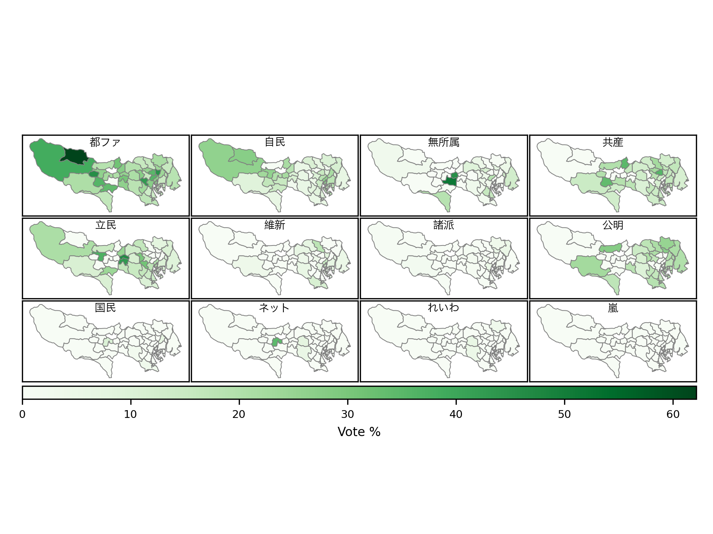

# 2021 Tokyo assembly elections

## Steps to reproduce

1. Go to https://www.yomiuri.co.jp/election/local/togisen2021/kouho/
2. Select the element with class `"uni-election-local-2021 local-2021-kouho"` and open it in Browser console
3. Copy the code in scraper.js to the Browser console and run `let res = main(districts)`
4. Save `res` into `raw_results.json`
5. Run `python process_json.py` to generate `processed_results.json`
6. Download the Japan administrative boundaries from https://gadm.org/download_country_v3.html (`gadm36_JPN_shp.zip`) and rename the Level 1 shapefile to `Tokyo_boundaries.geojson`
7. Run `python analyse.py` to generate `out.png`
